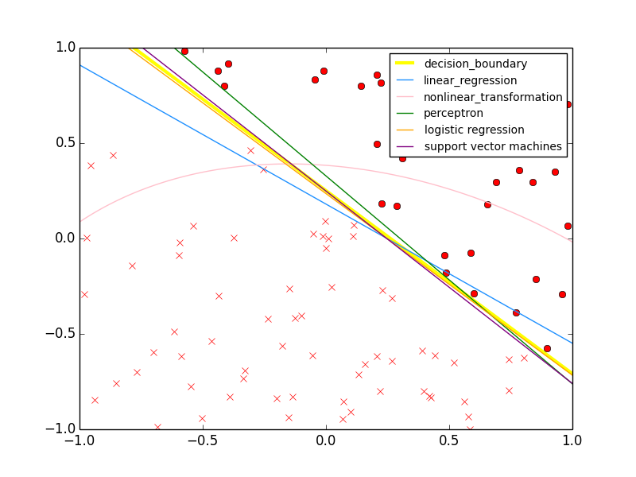

**Classification**

Creates a random decision boundary and tries to predict the boundary using different methods- linear regression, nonlinear regression, perceptron algorithm, logistic regression, and support vector machines.

Returns a table with in-sample error and out-of-sample error for each method.

sample output:

|Method                  |   in-sample error |   out-of-sample error|
|----------------------- | ----------------- | ---------------------|
|linear regression       |            0.0383 |                0.0609|
|nonlinear regression    |            0.0279 |                0.0748|
|perceptron algorithm    |            0      |                0.0295|
|logistic regression     |            0.0116 |                0.0066|
|support vector machines |            0      |                0.0088|

sample plot:

